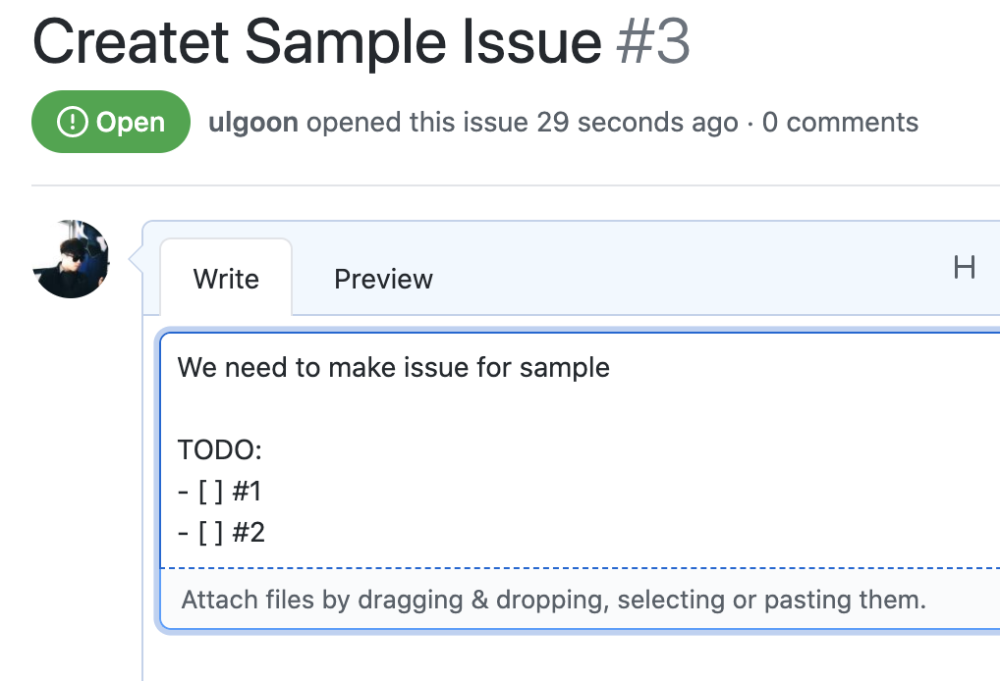
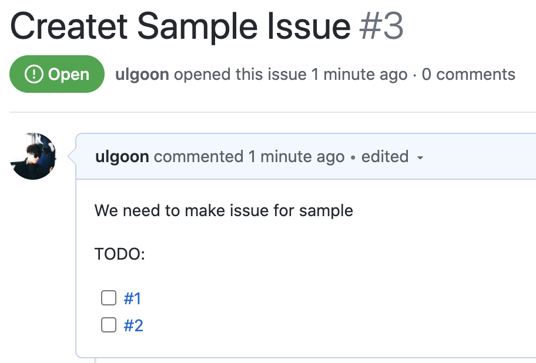
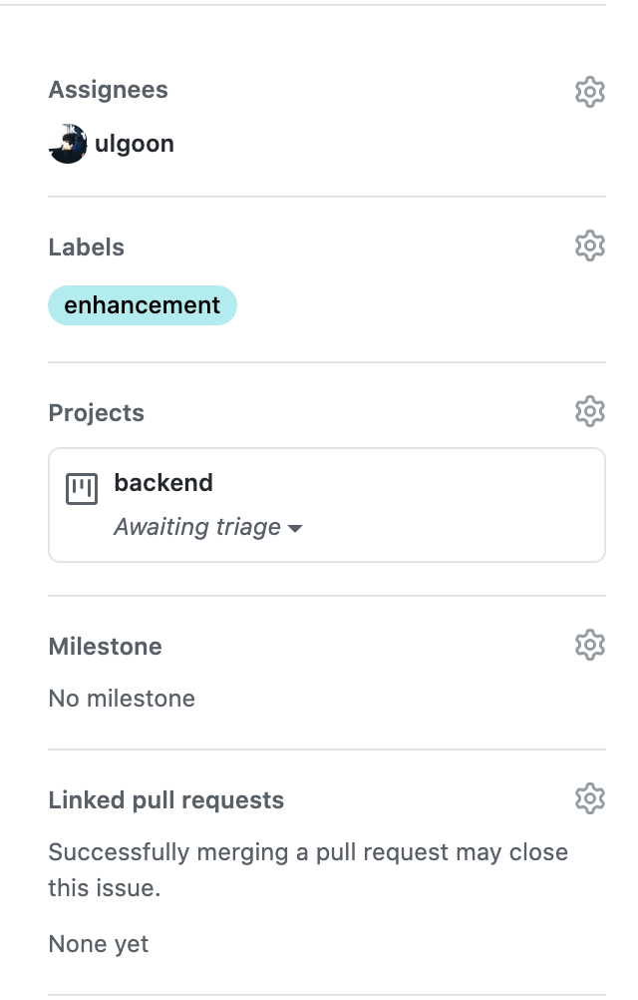
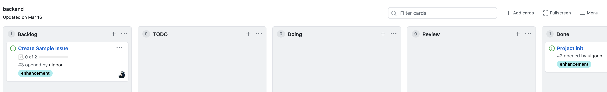
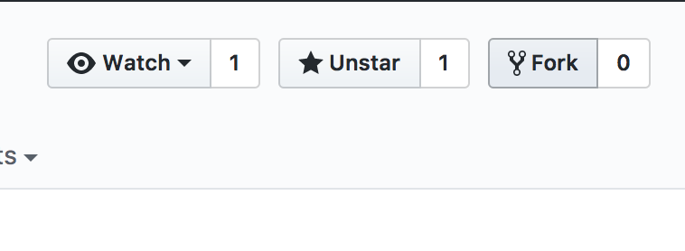
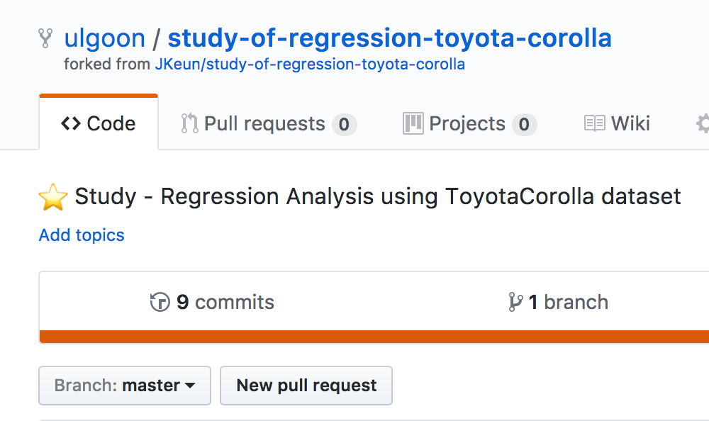
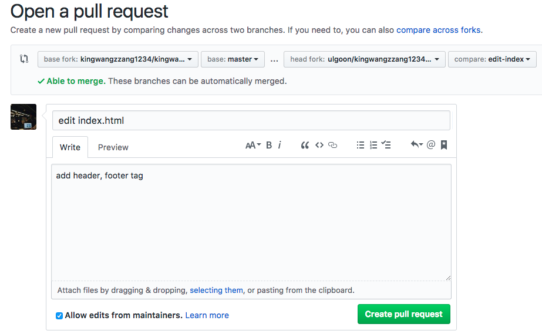
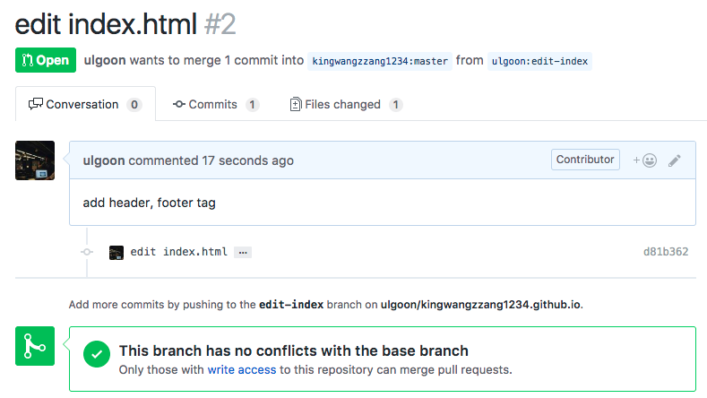
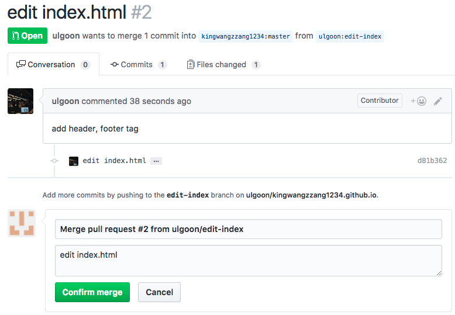

# git, github

## NKLCB

---

<!--
paginate: true
theme: default
size: 16:9
footer : 네카라쿠배 git,  Wooyoung Choi, 2021
-->

## Previously..

- git의 원활한 사용을 위한 CLI shell, vim command
- 개발문서 작성을 위한 Markdown 작성법
- 원활한 git 사용 및 개발을 위한 환경 구성
- git의 구성요소와 process 실습
- commit convention 습관화
- repository 필수 요소의 작성
- github pages를 이용한 github blog 만들기

---

## Today, We will learn about..

- Branch 사용법
- Branch 전략: git flow
- 상황별 되돌리기
- github issue와 projects 사용하기
- 협업 하는 법: Forking Workflow

---

## Branch
---

## Branch

- 분기점을 생성하여 독립적으로 코드를 변경할 수 있도록 도와주는 모델

`master`

```python
print('hello' + ' ' + 'world')
```

`develop`

```python
words = ['world', 'hello']
print(' '.join(words[:-1]))
```

---

## Branch(1)

Show available local branch
`$ git branch`

Show available remote branch
`$ git branch -r`

Show available All branch
`$ git branch -a`

---

## Branch(2)

Create branch
`$ git branch stem`

Checkout branch
`$ git checkout stem`

Create & Checkout branch
`$ git checkout -b new-stem`

make changes inside readme.md
`$ git commit -a -m 'edit readme.md'`
`$ git checkout master`

merge branch
`$ git merge stem`

---

## Branch(3)

delete branch
`$ git branch -D stem`

push with specified remote branch
`$ git push origin stem`

see the difference between two branches
`$ git diff master stem`

---

## Practice(1)

- Spiderman.md를 생성하고 다음의 정보를 배역을 맡은 배우별로 브랜치를 생성하여 이를 시각화 하세요.
- 완결된 브랜치는 master 브랜치로 merge 해야 합니다.
- 각 commit은 개봉연도 순서대로 존재해야 합니다.
- Format

```text
# {Movie Name}
- Year:
- Name:
```

---

- `TobeyMaguire` branch

```text
# Spider-Man 1
- Year: 2002
- Name: Peter Benjamin Parker

# Spider-Man 2
- Year: 2004
- Name: Peter Benjamin Parker

# Spider-Man 3
- Year: 2007
- Name: Peter Benjamin Parker
```

---

- `AndrewGarfield` branch

```text
# Amazing Spider-Man 1
- Year: 2012
- Name: Peter Benjamin Parker

# Amazing Spider-Man 2
- Year: 2014
- Name: Peter Benjamin Parker
```

---

- `Tom Holland` branch

```text
# Captain America: Civil War
- Year: 2016
- Name: Peter Benjamin Parker

# Spider-Man: Home Coming
- Year: 2017
- Name: Peter Benjamin Parker

# Avengers: Infinity war
- Year: 2018
- Name: Peter Benjamin Parker

# Avengers: Endgame
- Year: 2019
- Name: Peter Benjamin Parker

# Spider-Man: Far From Home
- Year: 2019
- Name: Peter Benjamin Parker
```

---

### Additional Practice

- Venom branch
- Into the Spider-verse branch(Miles Morales)

---

## branching models

- git flow
  - (hotfix)- `master` -(release)- `develop` - feature
  - pros: 가장 많이 적용, 각 단계가 명확히 구분
  - cons: 복잡..
- github flow
  - `master` - feature
  - pros: 브랜치 모델 단순화, `master`의 모든 커밋은 deployable
  - cons: CI 의존성 높음. 누구 하나라도 실수했다간..(pull request로 방지)
- gitlab flow
  - `production` - `pre-production` - `master` - feature
  - pros: deploy, issue에 대한 대응이 가능하도록 보완
  - cons: git flow와 반대 (`master`-develop, `production`-master)

---

## git flow strategy


---

## use git flow easily!

[Link](https:danielkummer.github.io/git-flow-cheatsheet/index.ko_KR.html)


---

## fibonacci 구현 with git flow

v1.0: recursion(점화식)
v1.1: recursion with memoization(점화식 + 메모리)
v2.0: binet's formula(공식)

### 꼭 해야 하는 것

1. 새로운 레포
2. 동일한 파일에 대한 버전
3. github issues, projects를 작업 전에 완료하기
---

## Practice(2)

- git flow 전략을 활용하여 어제 작성한 introduce.md를 index.html에 재작성하세요.

### Requirements

- develop 브랜치에서 다음 릴리즈를 위한 개발이 끝나야 합니다.
- head, body 등 section별 작업은 각각의 브랜치에서 작업되어야 합니다.
- css, js 작업 또한 각 브랜치를 소유합니다.(선택)
- [Semantic Web Elements](https:developer.mozilla.org/en-US/docs/Glossary/Semantics#Semantic_elements)를 적극 활용하세요.

---

## Revert Everything!

---

### Rename

- Worst
`$ mv server.py main.py` -> deleted, new file

- Best
`$ git mv server.py main.py` -> renamed

> 파일의 history를 남기기 위해서는 삭제 후 생성이 아닌 이름바꾸기로 추적

### [Undoing](https:asciinema.org/a/Fu27tl0y6RpHBPnTBHpPHh8St)

`$ git checkout -- .` or `$ git checkout -- {filename}`

---

### [Unstaging](https:asciinema.org/a/Y55mgQP0Yn8r6EEyBRSk0ysxX)

`$ git reset HEAD {filename}`

### Unstaging and Remove

`$ git rm -f {filename}`

---

### [Edit latest commit](https:asciinema.org/a/PplVwNAZND1lApmRLRo2q3jem)

`$ git commit --amend`

### [Edit prior commit](https:asciinema.org/a/03Kp8DnWV2mpBghfZ8MWAwN0q)

`$ git rebase -i <commit>`

#### [abort rebase](https:asciinema.org/a/ifWYyxutPfg04bTMrFA75KVms)

`$ git rebase --abort`

#### Complete rebase

`$ git rebase --continue`

---

### Reset Commit

#### Worst case: [Reset](https:asciinema.org/a/NvrtG3Nmf8cqa4gWlssjGmVEc)

ex) 직전 3개의 commit을 삭제한 후, remote에 강제 push

```shell
$ git reset --hard HEAD~3
$ git push -f origin <branch>
```

- 협업 시 다른 cloned repo에 존재하던 commit log로 인해 파일이 살아나거나, 과거 이력이 깔끔히 사라져 commit log tracking이 힘들어짐.
- solution: 잘못한 이력도 commit으로 박제하고 수정한 이력을 남기자!

---

#### Best case: [Revert](https://asciinema.org/a/ujEFWlHFz8VYWOV4pnnCMrTX6)

ex) 현재 HEAD에서 직전의 3개의 commit을 순서대로 거슬러 올라가 해당 내역에 대해 commit, push 수행

```shell
$ git revert --no-commit HEAD~3..

$ git commit

$ git push origin <branch>
```

- 잘못하기 전 과거로 돌아가 최신을 유지하면서 되돌렸다는 이력을 commit으로 남겨 모든 팀원이 이 사항을 공유하고 주지시킬 수 있음.
- commit을 따로 안할땐 `--no-edit`
- merge commit을 되돌릴 땐 `-m`(`$git revert -m {1 or 2} {merge commit id}`)
---

## github issue and projects

---

## Issue & Projects

Issue: 프로젝트, 레포와 관계된 모든 해야할 일과 버그, 개선사항 등을 기록

Projects: 해야할 일의 진도에 따른 구성과 우선순위 지정

---

### Issue(1)



---

### Issue(2)



---

### Issue(3-1)



---

### Issue(3-2)

- Assignees: 이 이슈에 대한 책임인원
- Labels: 이슈의 종류
- Projects: 이슈를 배당할 프로젝트
- Milestone: 이슈에 해당하는 중요 시점 지정

---

### Projects

---

### Projects(2)



---

## Collaborate with your teammates

---

### Forking workflow

---

## Collaboration

Add, Commit and Push like you own it. 

---

## Method 2: Fork and Merge



---

## Fork and Merge


---

## Fork and Merge



---

## Fork and Merge

`$ git clone https://github.com/username/forked-repo.git`

---

## Fork and Merge

`$ git branch -a`
`$ git checkout -b new-feature`

---

## Fork and Merge

Make some change

`$ git add file`
`$ git commit -m "commit message"`
`$ git push origin new-feature`

---

## Fork and Merge


---

## Fork and Merge



---

## Fork and Merge



---

## Fork and Merge


---

## Fork and Merge


---

## Fork and Merge



---

## Fork and Merge


---

### dev2,dev3,devn, .. : Update develop branch

#### In case of having upstream

```shell
$ git fetch upstream develop
$ git merge FETCH_HEAD
```

```shell
$ git remote add pmorigin {PM repo addr}
$ git fetch pmorigin develop
$ git merge FETCH_HEAD
```

---

## Practice(3)

- 수업 중 제공되는 저의 repository 주소에 접근하여 fork 한 뒤, 하고 싶은 말을 Chat.md 에 pull request 하세요.

---

## Practice(4)

- 3~4인이 팀이 되어 프로젝트 수행
- 아래의 과제 중 하나 이상을 수행할 것
  1. [피보나치킨](https:fibonachicken.herokuapp.com/) 클론(치킨과 인원 수에 따라 적절한 맥주의 용량도 출력)
  2. 블랙잭 게임
  3. [What's my value?](https:www.transfermarkt.com/whatsMyValue) 게임(11번가 베스트 중 [가전/디지털](http:www.11st.co.kr/browsing/BestSeller.tmall?method=getBestSellerMain&cornerNo=10) 스크래핑 후 진행)
- Requirements
  - 타겟 플랫폼, 언어나 Framework는 팀 내 협의 후 결정
  - 서비스 기획 -> backlog 작성(issue, projects) -> 개발 -> 평가 순으로 진행

---

## Wrap it up!

- branch를 활용한 개발은 코드의 독립성을 보장한다.
- branching strategy 중 git flow 전략을 잘 활용하면 깔끔한 코드관리와 CI/CD에서도 도움이 될 수 있다.
- 모든 잘못된 작업은 push 하기 전까지 아무도 모르게 되돌릴 수 있다.
- issue와 projects를 활용하면, 현재 프로젝트의 진행상황을 깔끔하게 관리할 수 있다.
- git flow 전략과 forking workflow를 활용하면 비동기적 분산형 저장소의 장점을 잘 살릴 수 있다.

<link href="https://fonts.googleapis.com/css?family=Nanum+Gothic:400,800" rel="stylesheet">
<link rel='stylesheet' href='//cdn.jsdelivr.net/npm/hack-font@3.3.0/build/web/hack-subset.css'>

<style>
h1,h2,h3,h4,h5,h6,
p,li, dd, table > * > * {
font-family: 'Nanum Gothic', Gothic;
}
span, pre {
font-family: 'Hack', monospace;
}
</style>